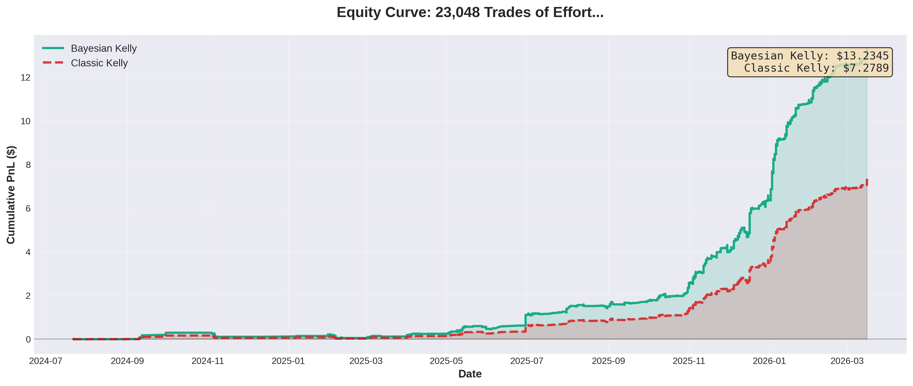
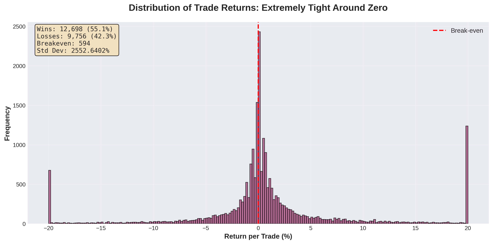
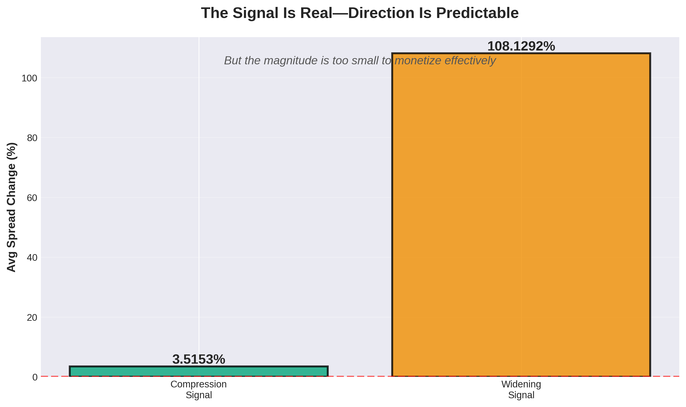
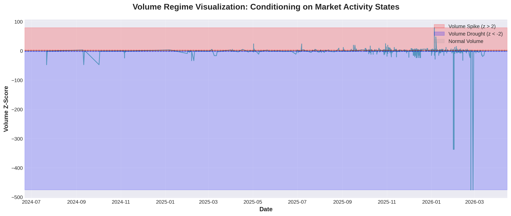
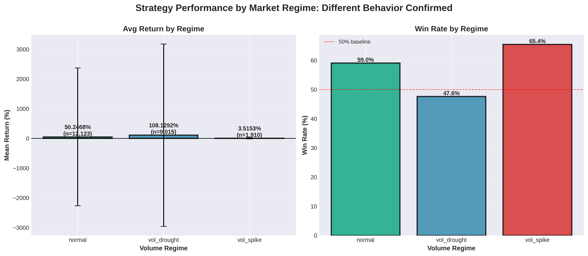
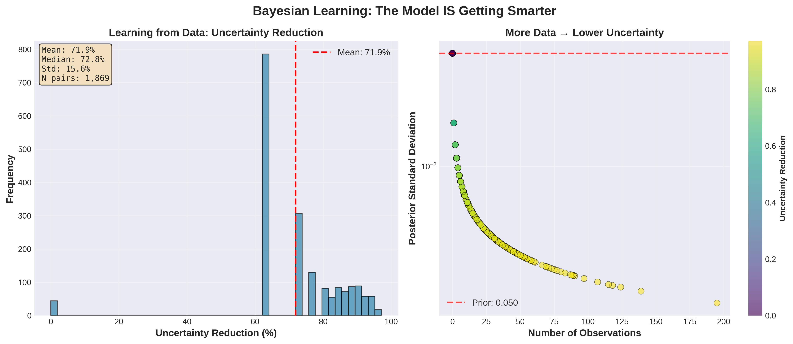
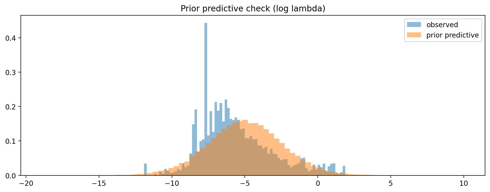
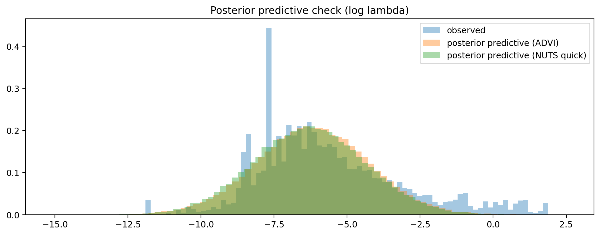
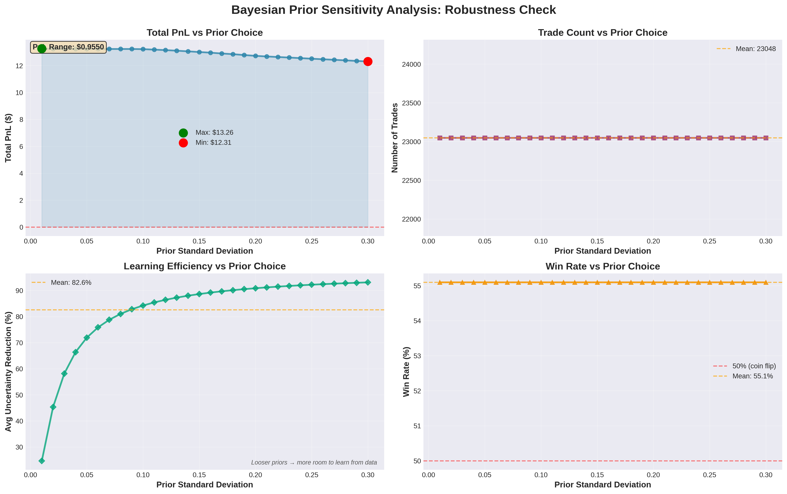
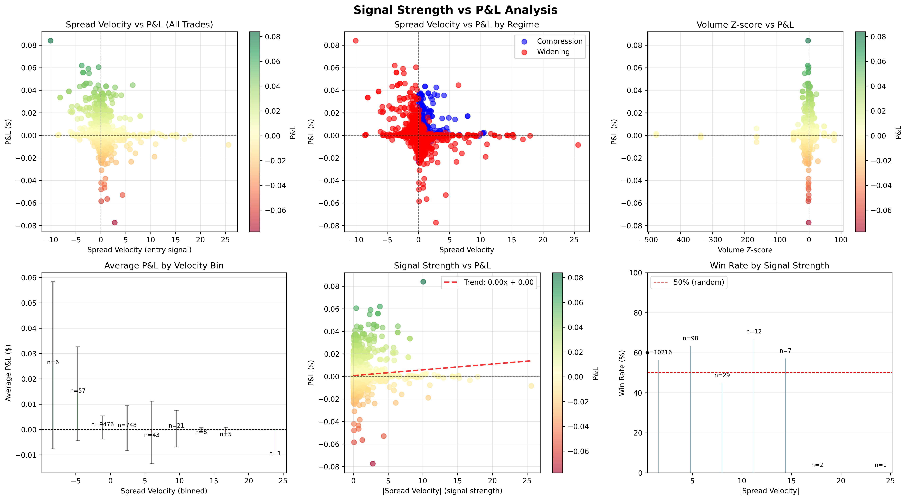

# Polymarket Bayesian Trading Strategies

A comprehensive framework for analyzing and trading prediction markets using Bayesian statistics, implementing multiple quantitative strategies with risk-aware position sizing.

## Overview

This project applies Bayesian statistical methods to Polymarket prediction markets, focusing on time-discounting and hazard rate dynamics. It implements several trading strategies that exploit predictable patterns in how markets price time-to-event probabilities, using full Bayesian inference for parameter estimation and the Kelly Criterion for optimal position sizing under uncertainty.

### Key Features

- **Bayesian Kelly Criterion**: Position sizing that accounts for uncertainty in edge estimation
- **Multiple Trading Strategies**: Carry, spread dynamics, survival conditional, and more
- **Full Bayesian Inference**: PyMC-based NUTS sampling for parameter estimation
- **Interactive Dashboard**: Real-time visualization of implied hazard rates and term structures
- **Comprehensive Backtesting**: Historical performance analysis with multiple hedging variants
- **Time Discounting Models**: Quantify how markets misprice time-to-event probabilities

### Strategy Performance


*Portfolio equity curve showing strategy performance over time*


*Distribution of daily returns across all strategies*

## Project Structure

```
polymarket/
├── dashboard.py              # Main Streamlit dashboard
├── requirements.txt          # Python dependencies
├── scripts/
│   ├── backtests/           # Strategy backtest implementations
│   ├── visualization/        # Chart and plot generation
│   ├── train_model.py       # Bayesian model training
│   ├── run_dashboard.sh     # Dashboard launch script
│   └── update_prices.sh     # Price data updater
├── docs/                     # Documentation and strategy specs
├── final_submission/         # Academic project deliverables
├── data/                     # Market data and databases
│   ├── polymarket.db        # SQLite database
│   ├── downloaders/         # Data collection scripts
│   └── queries/             # SQL query helpers
├── models/                   # Bayesian models and inference
├── backtest/                 # Backtesting engine
│   └── strategies/          # Strategy implementations
├── utils/                    # Helper functions
├── analysis/                 # Analysis notebooks/scripts
├── presentation_charts/      # Generated visualizations
├── backtest_results/         # Backtest outputs
└── tests/                    # Unit tests
```

## Installation

### Prerequisites

- Python 3.8+
- Virtual environment (recommended)
- SQLite3

### Setup

1. **Clone the repository**
   ```bash
   git clone <repository-url>
   cd polymarket
   ```

2. **Create and activate virtual environment**
   ```bash
   python3 -m venv venv
   source venv/bin/activate  # On Windows: venv\Scripts\activate
   ```

3. **Install dependencies**
   ```bash
   pip install -r requirements.txt
   ```

4. **Fetch market data** (optional - if database is empty)
   ```bash
   bash scripts/update_prices.sh
   ```

## Usage

### Launch Dashboard

View real-time implied hazard rates and term structures:

```bash
bash scripts/run_dashboard.sh
# Or directly:
streamlit run dashboard.py
```

The dashboard will open at `http://localhost:8501`

### Run Backtests

Each strategy has its own backtest script:

```bash
# Bayesian Carry Strategy
python scripts/backtests/run_bayesian_carry_backtest.py

# Spread Dynamics Strategy
python scripts/backtests/run_spread_dynamics_backtest.py

# Survival Conditional Strategy
python scripts/backtests/run_survival_conditional_backtest.py

# Factored Gamma Strategy
python scripts/backtests/run_factored_gamma_backtest.py
```

Results are saved to `backtest_results/`

### Train Models

Train the Bayesian time-discounting model:

```bash
python scripts/train_model.py --draws 2000 --output-dir model_output
```

### Generate Visualizations

```bash
# Create presentation charts
python scripts/visualization/create_presentation_charts.py

# Prior sensitivity analysis
python scripts/visualization/prior_sensitivity_analysis.py

# Signal-to-PnL analysis
python scripts/visualization/plot_signal_to_pnl.py
```

## Trading Strategies

### 1. Bayesian Carry Strategy
Exploits time decay in short-dated contracts using Bayesian posterior inference for edge estimation.

- **Signal**: Buy underpriced "No" contracts (price < 0.10) in short-dated markets
- **Position Sizing**: Fractional Kelly based on posterior uncertainty
- **Variants**: Baseline, Volume-hedged, Cash-hedged

### 2. Spread Dynamics Strategy
Trades anticipated changes in implied rate spreads between contracts.

- **Signal**: Spread velocity + volume regime classification
- **Edge**: Predicts spread compression/widening before it occurs
- **Key Insight**: Anticipates regime transitions rather than reacting to mispricings

### 3. Survival Conditional Strategy
Exploits conditional repricing as time passes without event resolution.

- **Signal**: Markets that should update probabilities as time passes
- **Math**: Conditional survival probability P(T > t + Δt | T > t)

### 4. Factored Gamma Strategy
Compares market-implied hazard rates to model-based estimates.

- **Model**: Bayesian gamma process with covariate effects
- **Signal**: Deviation between market rate and posterior mean model rate
- **Uses**: Semantic grouping and slug co-occurrence features

### 5. Time Discounting Strategy
Direct exploitation of systematic time-discounting biases.

- **Finding**: Markets systematically misprice time-to-event
- **Model**: Full Bayesian hierarchical model via PyMC
- **Features**: Market semantics, trading volume, event characteristics

### Strategy Visualizations


*Spread change patterns by signal type in the Spread Dynamics strategy*


*Volume regime classification and its impact on trading signals*


*Strategy performance breakdown by market regime*

## Mathematical Framework

### Bayesian Kelly Criterion

Traditional Kelly assumes known edge μ:
```
f = μ / σ²
```

Bayesian Kelly accounts for uncertainty:
```
f = μ_posterior / (σ_obs² + σ_posterior²)
```

- **Uncertain edge** → smaller positions
- **Confident edge** → larger positions
- **Updates online** as trades complete

### Implied Hazard Rate

From market probability P(T) and time-to-event T:
```
λ = -ln(1 - P(T)) / T
```

Where λ is the implied instantaneous hazard rate.

### Conjugate Priors

Uses Normal-Normal conjugate priors for analytical Bayesian updates:
```python
precision_posterior = precision_prior + precision_obs
μ_posterior = (μ_prior * precision_prior + observed * precision_obs) / precision_posterior
```

No MCMC needed for online position sizing updates.

### Bayesian Learning in Action


*Evolution of posterior beliefs as the model observes more data - showing uncertainty reduction and mean convergence*

## Model Validation

### Prior & Posterior Predictive Checks


*Prior predictive check showing model assumptions before seeing data*


*Posterior predictive check validating model fit against observed data*

### Prior Sensitivity Analysis


*Robustness analysis showing how results vary with different prior specifications*

### Signal Quality Analysis


*Relationship between trading signals and realized profit/loss*

## Data Sources

- **Polymarket API**: Live market prices and volumes
- **SQLite Database**: Local storage of historical price data
- **Market Metadata**: Event descriptions, resolution dates, semantic groupings

## Key Dependencies

- **PyMC**: Bayesian inference and MCMC sampling
- **Streamlit**: Interactive dashboard
- **Pandas/NumPy**: Data manipulation
- **Plotly**: Interactive visualizations
- **Scipy**: Statistical computations
- **SQLite3**: Data persistence

## Academic Context

This project was developed for STAT 519/619 (Bayesian Statistics). It demonstrates:

- **Conjugate priors** for online learning
- **Hierarchical Bayesian models** for grouped data
- **MCMC diagnostics** and convergence analysis
- **Posterior predictive checks**
- **Sequential Bayesian updating**
- **Decision theory** under uncertainty (Kelly Criterion)

## Documentation

- `docs/BAYESIAN_KELLY_EXPLANATION.md` - Detailed mathematical explanation of Bayesian Kelly
- `docs/instructions.md` - Spread Dynamics strategy specification
- `docs/instructions2.md` - Additional implementation notes

## Results Location

- **Backtests**: `backtest_results/`
- **Model Output**: `model_output/`
- **Charts**: `presentation_charts/`
- **Analysis**: `analysis/`

## Contributing

This is an academic project. For questions or collaboration:
- Review strategy specifications in `docs/`
- Check backtest implementations in `backtest/strategies/`
- Examine model definitions in `models/`

## License

Academic project - see final submission materials in `final_submission/`

## References

- Kelly, J.L. (1956). "A New Interpretation of Information Rate"
- Thorp, E.O. (2008). "The Kelly Criterion in Blackjack Sports Betting"
- Gelman et al. (2013). "Bayesian Data Analysis"
- PyMC Documentation: https://www.pymc.io/

## Authors

Jamie Sanson & Tyrell Jaques

---

**Note**: This framework is for educational and research purposes. Trading prediction markets involves risk. Past performance does not guarantee future results.
